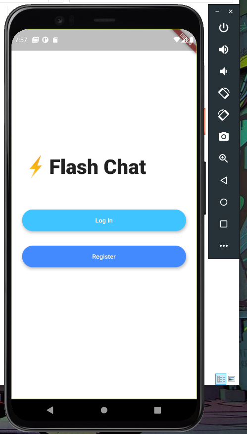
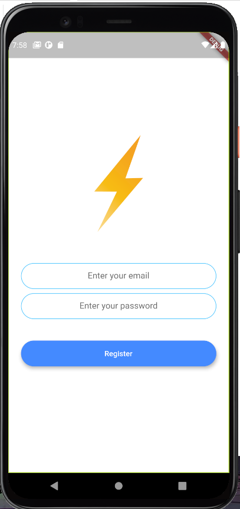
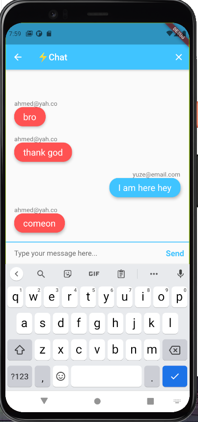

# Chat APP
- This app was a module to follow along and learn how to use firebase and authenticate users.
- How to add collections and retrieve data from the database.
- How to create simple Hero animations and such.
# Screenshots
 | |
